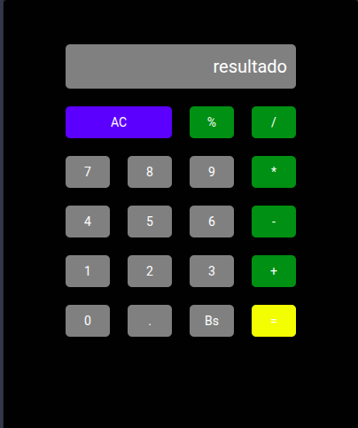

# Projeto - Calculadora React Native

Uma simples calculadora feita em React Native, utilizando a tecnologia fornecida pela [Expo](https://expo.dev).

## Levantamento de requisitos:

1 - Funcionais:
   - Digitar números de 0 a 9;
   - Realizar operações matemáticas (soma, subtração, multiplicação, divisão);
   - Mostrar o resultado correto no display;
   - Ser necessário limpar o display interiro, ou apenas um dígito por vez

2 - Não-Funcionais:
   - Usabilidade simples e intuitiva;
   - Deve funcionar na web e pelos celulares android e iOS

## Protótipo visual:



## Fluxo de funcionamento
   1. Usuário digita um número;
   2. Usuário seleciona o operador;
   3. Usuário digita o segundo número;
   4. Usuário pressiona o botão de "=";
   5. Sistema calcula o resultado;
   6. Resultado é exibido no display.


# Welcome to your Expo app 👋

This is an [Expo](https://expo.dev) project created with [`create-expo-app`](https://www.npmjs.com/package/create-expo-app).

## Get started

1. Install dependencies

   ```bash
   npm install
   ```

2. Start the app

   ```bash
   npx expo start
   ```

In the output, you'll find options to open the app in a

- [development build](https://docs.expo.dev/develop/development-builds/introduction/)
- [Android emulator](https://docs.expo.dev/workflow/android-studio-emulator/)
- [iOS simulator](https://docs.expo.dev/workflow/ios-simulator/)
- [Expo Go](https://expo.dev/go), a limited sandbox for trying out app development with Expo

You can start developing by editing the files inside the **app** directory. This project uses [file-based routing](https://docs.expo.dev/router/introduction).

## Get a fresh project

When you're ready, run:

```bash
npm run reset-project
```

This command will move the starter code to the **app-example** directory and create a blank **app** directory where you can start developing.

## Learn more

To learn more about developing your project with Expo, look at the following resources:

- [Expo documentation](https://docs.expo.dev/): Learn fundamentals, or go into advanced topics with our [guides](https://docs.expo.dev/guides).
- [Learn Expo tutorial](https://docs.expo.dev/tutorial/introduction/): Follow a step-by-step tutorial where you'll create a project that runs on Android, iOS, and the web.

## Join the community

Join our community of developers creating universal apps.

- [Expo on GitHub](https://github.com/expo/expo): View our open source platform and contribute.
- [Discord community](https://chat.expo.dev): Chat with Expo users and ask questions.
